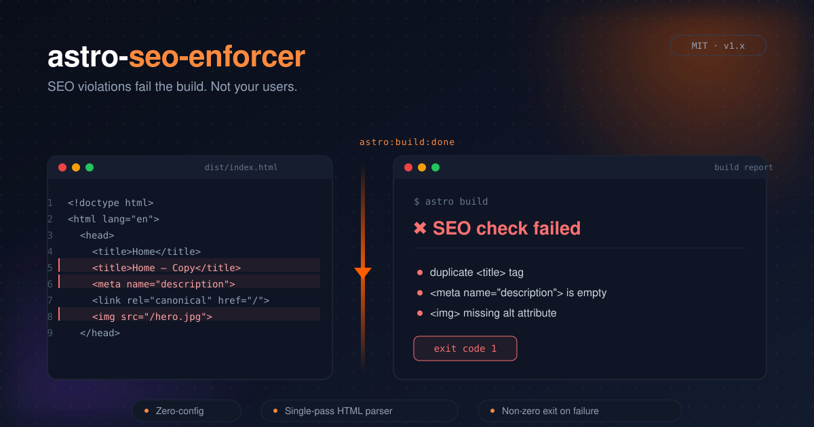

# astro-seo-enforcer



[](https://github.com/SlashGordon/astro-seo-enforcer/actions/workflows/release.yml)

[](https://github.com/SlashGordon/astro-seo-enforcer/actions/workflows/ci.yml)

> An Astro integration that parses your final, generated static HTML and fails the build when it detects SEO or security problems.

`astro-seo-enforcer` hooks into `astro:build:done`, walks the output directory,
parses every `.html` file with [`node-html-parser`](https://github.com/taoqf/node-html-parser)
and runs a set of configurable SEO rules. If anything is wrong it prints a
readable report and exits with a non-zero code so your CI/CD pipeline fails.

SEO and security go hand in hand, so the tool helps you test both. During the
build it checks titles, canonicals, links, sitemaps and `robots.txt`, and on
request your `_headers` file and every page against its Content-Security-Policy.
After the deploy, [`astro-seo-enforcer live`](#live-checks-post-deploy) checks
what the server actually sends: DNS and redirects for the apex and `www` hosts,
HSTS and the other security headers, and a sample of the live pages.

- Checks the real HTML shipped to users, not your source `.astro` files.
- Runs with no configuration, and takes a full config object when you need one.
- Uses a lightweight HTML parser with a single pass per file.
- Built for CI: a grouped, colourised report and a non-zero exit code on failure.

It started as the build gate for [patioplanner.app](https://www.patioplanner.app/) and grew into a standalone integration from there. It now also runs in production on [slashgordon.link](https://www.slashgordon.link/), [druckzug.pro](https://www.druckzug.pro/), [howtolosemoneyfast.com](https://www.howtolosemoneyfast.com/) and [html-to-markdown-ai.com](https://www.html-to-markdown-ai.com/).

---

## Installation

### Automatic setup

```bash
npx astro add astro-seo-enforcer
# or
pnpm astro add astro-seo-enforcer
# or
yarn astro add astro-seo-enforcer
```

This installs the package and adds it to the `integrations` array in your
`astro.config.*` for you. Then jump to [Configuration](#configuration).

### Manual setup

```bash
npm install -D astro-seo-enforcer
# or
pnpm add -D astro-seo-enforcer
# or
yarn add -D astro-seo-enforcer
```

Add it to your `astro.config.*`:

```js
// astro.config.mjs
import { defineConfig } from 'astro/config';
import seoEnforcer from 'astro-seo-enforcer';

export default defineConfig({
  // `site` is strongly recommended so Astro can emit absolute canonical URLs.
  site: 'https://example.com',
  integrations: [seoEnforcer()],
});
```

Run `astro build` and the checks run automatically once the static files are
written.

> **Note:** the integration only does something during `astro build`. It is a
> no-op during `astro dev`.

---

## Example output

```
astro-seo-enforcer — SEO violation report
────────────────────────────────────────────────────────────────

about/index.html  (2 error(s), 0 warning(s))
  ✖ error   [title] <title> is too short: 12 chars (min 30) — "About page".
  ✖ error   [canonical] Missing <link rel="canonical" href="…">.
             ↳ Emit a canonical link in your <head> (e.g. using Astro.url and the `site` config).

blog/hello/index.html  (0 error(s), 1 warning(s))
  ⚠ warning [anchorText] Non-descriptive link text "read more" (href="/blog/hello/full").
             ↳ Use link text that still makes sense out of context, e.g. "Read the setup guide".

────────────────────────────────────────────────────────────────
14 page(s) scanned  ·  2 error(s)  ·  1 warning(s)
```

With the default `failOn: "error"` this build exits with code `1`.

---

## Configuration

Everything is optional. Pass a config object to `seoEnforcer()`:

```js
import seoEnforcer from 'astro-seo-enforcer';

seoEnforcer({
  enabled: true,
  failOn: 'error', // 'error' | 'warning' | 'never'
  exclude: [
    '404.html', // exact file (this one is excluded by default)
    'drafts/**', // glob: everything under /drafts
    '**/*.amp.html', // glob across segments
    /^private\//, // RegExp against the POSIX relative path
  ],
  rules: {
    title: { minLength: 30, maxLength: 65, checkDuplicates: true },
    metaDescription: { minLength: 70, maxLength: 160, checkDuplicates: true },
    headingHierarchy: {
      requireSingleH1: true,
      enforceNoSkips: true,
      requireH1First: true,
      checkDuplicateH1: true,
    },
    semanticHtml: { landmarkTags: ['main', 'header', 'footer'], minLandmarks: 2 },
    imageAlt: true,
    canonical: { requireAbsolute: true },
    anchorText: { bannedPhrases: ['click here', 'read more', 'more', 'link', 'here'] },
    internalLinks: {
      checkFragments: true,
      fragmentSeverity: 'warning',
      ignore: ['/go/newsletter'],
    },
    jsDependency: { minTextLength: 120 },
    robots: { severity: 'warning', directives: ['noindex', 'nofollow'] },
    duplicateId: true,
    imageSize: {
      severity: 'warning',
      maxBytes: 204800, // 200 KB
      requireDimensions: true,
      maxScaleFactor: 2,
    },
    duplicateContent: {
      severity: 'warning',
      threshold: 0.9,
      minUniqueRatio: 0.2,
      scopeToMain: true,
      minWords: 200,
    },
    thinContent: { severity: 'warning', minWords: 250, scopeToMain: true },
    structuredData: { severity: 'warning', require: false, requireTypes: ['BreadcrumbList'] },
    orphanPages: { severity: 'warning', entryPoints: ['index.html'] },
    sitemapCoverage: { severity: 'warning', requireInSitemap: true },
    robotsTxt: { severity: 'warning', requireSitemap: true },
    // Site hygiene, off by default and not part of the SEO score:
    llmsTxt: true,
    securityHeaders: { file: '_headers', checkCsp: true },
    legalPages: true,
  },
  // Weights behind the SEO health score (see "Score & reports" below).
  score: { errorWeight: 6, warningWeight: 1.5 },
  // Write a JSON / HTML report to disk, e.g. for a CI/CD artifact.
  report: { json: true, html: 'reports/seo.html' },
});
```

For editor autocompletion you can use the `defineSeoEnforcerConfig` helper:

```js
import seoEnforcer, { defineSeoEnforcerConfig } from 'astro-seo-enforcer';

const seoConfig = defineSeoEnforcerConfig({
  rules: { title: { maxLength: 65 } },
});

export default defineConfig({
  integrations: [seoEnforcer(seoConfig)],
});
```

### Top-level options

| Option    | Type                              | Default        | Description                                                                  |
| --------- | --------------------------------- | -------------- | ---------------------------------------------------------------------------- |
| `enabled` | `boolean`                         | `true`         | Master switch. `false` disables the integration completely.                  |
| `exclude` | `Array<string \| RegExp>`         | `['404.html']` | Paths to skip. Supports plain prefixes, `*` / `**` globs and `RegExp`.       |
| `failOn`  | `'error' \| 'warning' \| 'never'` | `'error'`      | Which severity breaks the build. `'never'` only prints the report.           |
| `rules`   | `object`                          | see below      | Per-rule configuration. Set any rule to `false` to disable it.               |
| `score`   | `object`                          | see below      | Weights behind the SEO health score. See [Score & reports](#score--reports). |
| `report`  | `object`                          | see below      | Write a JSON / HTML report to disk. See [Score & reports](#score--reports).  |

`exclude` patterns are matched against the POSIX path relative to the build
output directory (e.g. `blog/hello/index.html`).

### Rules

Set a rule to `false` to disable it, `true` to enable it with defaults, or pass
an object to override individual options.

| Rule               | Default severity | What it checks                                                                                                                                                                                                                                                                                                                                                                                                                                                                                                                                                                  |
| ------------------ | ---------------- | ------------------------------------------------------------------------------------------------------------------------------------------------------------------------------------------------------------------------------------------------------------------------------------------------------------------------------------------------------------------------------------------------------------------------------------------------------------------------------------------------------------------------------------------------------------------------------- |
| `title`            | error            | `<title>` exists and its length is between `minLength` and `maxLength` chars. With `checkDuplicates`, the same title on two pages fails the build.                                                                                                                                                                                                                                                                                                                                                                                                                              |
| `metaDescription`  | error            | `<meta name="description">` exists and its length is between `minLength` and `maxLength` chars. With `checkDuplicates`, the same description on two pages is a warning.                                                                                                                                                                                                                                                                                                                                                                                                         |
| `headingHierarchy` | error            | Exactly one `<h1>` (`requireSingleH1`); no skipped levels such as `h2` → `h4` (`enforceNoSkips`); optional `requireH1First`. With `checkDuplicateH1`, the same `<h1>` text on two pages is a warning (keyword cannibalisation).                                                                                                                                                                                                                                                                                                                                                 |
| `semanticHtml`     | error            | At least `minLandmarks` distinct landmark tags from `landmarkTags` (or their ARIA-role equivalents) are present.                                                                                                                                                                                                                                                                                                                                                                                                                                                                |
| `imageAlt`         | error            | Every `` has an `alt` attribute (`alt=""` is allowed for decorative images; a missing attribute is not).                                                                                                                                                                                                                                                                                                                                                                                                                                                                   |
| `canonical`        | error            | Exactly one `<link rel="canonical">` with a non-empty `href`. With `requireAbsolute`, the href must be an absolute http(s) URL.                                                                                                                                                                                                                                                                                                                                                                                                                                                 |
| `anchorText`       | warning          | `<a>` elements do not use generic text from `bannedPhrases`, and links are not left without any accessible name.                                                                                                                                                                                                                                                                                                                                                                                                                                                                |
| `internalLinks`    | error            | Every internal `<a href>` resolves to a page or asset that exists in the build output, matched the way a static host serves files (`/blog/` and `/blog` both resolve to `blog/index.html`). With `checkFragments`, a same-page `#section` link must match an `id` or `<a name>` on the page; a broken fragment is reported at `fragmentSeverity` (`warning` by default, since JS-rendered anchors are absent from the built HTML). External links, `mailto:`/`tel:`, `href="#"` and query-only links are ignored.                                                               |
| `jsDependency`     | error            | The page's `<main>` / `<article>` region (or `<body>` without one, or with `scopeToMain: false`) contains at least `minTextLength` characters of visible text; an empty region suggests client-only rendering. A short `<h1>` matching `noJsNotice` ("JavaScript required", "Please enable JavaScript", German and Spanish variants) is flagged as the sign of a shell page.                                                                                                                                                                                                    |
| `robots`           | warning          | Warns (configurable via `severity`) when `<meta name="robots">` / `googlebot` contains one of `directives` (`noindex` / `nofollow`).                                                                                                                                                                                                                                                                                                                                                                                                                                            |
| `duplicateId`      | error            | No `id` attribute value is used more than once in a document.                                                                                                                                                                                                                                                                                                                                                                                                                                                                                                                   |
| `imageSize`        | warning          | Local images weigh no more than `maxBytes`. The weight check covers `` and every URL in an `` or `<picture>` `<source srcset>`. Images also carry `width`/`height` (`requireDimensions`) so the browser can reserve space and avoid layout shift.                                                                                                                                                                                                                                                                                                          |
| `duplicateContent` | warning          | Flags pages whose visible text is near-identical to another page's: the Jaccard overlap of their five-word runs is at or above `threshold` (default `0.9`). A second pass flags any page less than `minUniqueRatio` (default `0.2`) of whose text is unique to it, catching many-way templating no single pair trips. With `scopeToMain` (default), the `<main>` / `<article>` region is compared instead of the whole `<body>`, so shared nav and footer text stays out of it. Pages shorter than `minWords` words are ignored; the pairwise pass is skipped above `maxPages`. |
| `thinContent`      | warning          | Flags pages with fewer than `minWords` words (default 250) in their main content, a common failure on templated or programmatic pages. With `scopeToMain` (default), only the `<main>` / `<article>` region is counted; pages with no such region fall back to `<body>`.                                                                                                                                                                                                                                                                                                        |
| `structuredData`   | warning          | Every `<script type="application/ld+json">` must contain valid JSON. With `requireTypes`, the listed `@type` values (e.g. `BreadcrumbList`) must appear in the page's JSON-LD. With `require`, a page that ships no JSON-LD at all is flagged.                                                                                                                                                                                                                                                                                                                                  |
| `orphanPages`      | warning          | Flags HTML pages that no other page links to and no sitemap lists. `entryPoints` (default `['index.html']`) are always considered reachable; use `ignore` for intentional stand-alone pages.                                                                                                                                                                                                                                                                                                                                                                                    |
| `sitemapCoverage`  | warning          | Cross-checks the build against its `sitemap*.xml`: every `<loc>` must resolve to a real file, every indexable page should be listed (`requireInSitemap`), and a page must not be both `noindex` and in a sitemap. With no sitemap present and `requireInSitemap`, emits a single notice.                                                                                                                                                                                                                                                                                        |
| `robotsTxt`        | warning          | `robots.txt` exists, does not block the whole site for `*` or Googlebot, and its `Sitemap:` lines are absolute URLs to sitemaps that exist in the build (`requireSitemap` wants at least one). Pages a sitemap lists but `robots.txt` disallows are flagged, since the two contradict each other.                                                                                                                                                                                                                                                                               |

#### Site hygiene rules

Not SEO in the narrow sense, but checks a static site should pass before it
ships. All three are off by default and do not count toward the SEO score.
They still show up in the report and in `failOn`.

| Rule              | Default severity | What it checks                                                                                                                                                                                                                                                                                                                                                                                                                                                                                               |
| ----------------- | ---------------- | ------------------------------------------------------------------------------------------------------------------------------------------------------------------------------------------------------------------------------------------------------------------------------------------------------------------------------------------------------------------------------------------------------------------------------------------------------------------------------------------------------------ |
| `llmsTxt`         | warning          | [`llms.txt`](https://llmstxt.org) exists and opens with a `# Title` heading. With `checkLinks`, relative links and absolute links to your Astro `site` must resolve to files in the build (e.g. the `.md` copies of your pages).                                                                                                                                                                                                                                                                             |
| `securityHeaders` | warning          | A Netlify / Cloudflare Pages `_headers` file sets every header in `requiredHeaders` for `/` and protects against framing (`X-Frame-Options` or CSP `frame-ancestors`). With `checkCsp`, every page's scripts, stylesheets, images, media, frames, inline `<script>`/`<style>` and `style=""`/`on*=""` attributes are checked against the Content-Security-Policy that applies to that page, so a new third-party host or a changed inline script fails the build instead of breaking silently in production. |
| `legalPages`      | warning          | Every page links to each entry in `links`, matched against the link's `href` and text. The default looks for an Impressum (`impressum`, `imprint`, `legal notice`) and a privacy policy (`datenschutz`, `privacy`); § 5 DDG requires the Impressum to be reachable from every page.                                                                                                                                                                                                                          |

#### Rule option reference

```ts
interface TitleRuleOptions {
  minLength: number; // default 30
  maxLength: number; // default 60
  checkDuplicates: boolean; // default true
}

interface MetaDescriptionRuleOptions {
  minLength: number; // default 50
  maxLength: number; // default 160
  checkDuplicates: boolean; // default true; same description on 2+ pages -> warning
}

interface HeadingHierarchyRuleOptions {
  requireSingleH1: boolean; // default true
  enforceNoSkips: boolean; // default true
  requireH1First: boolean; // default false
  checkDuplicateH1: boolean; // default true; same <h1> text on 2+ pages -> warning
}

interface SemanticHtmlRuleOptions {
  landmarkTags: string[]; // default ['main','header','nav','footer','article','section','aside']
  minLandmarks: number; // default 1
}

interface AnchorTextRuleOptions {
  bannedPhrases: string[]; // default ['click here','read more','more','link','here','learn more','continue','this page']
}

interface InternalLinksRuleOptions {
  severity: 'error' | 'warning'; // default 'error'; for a missing page/asset
  checkFragments: boolean; // default true
  fragmentSeverity: 'error' | 'warning'; // default 'warning'; for a broken #fragment
  ignore: Array<string | RegExp>; // default []; raw href values to skip
}

interface JsDependencyRuleOptions {
  minTextLength: number; // default 50
  scopeToMain: boolean; // default true; measure <main>/<article>, fall back to <body>
  noJsNotice: RegExp | false; // default matches "JavaScript required" & co.; false disables
}

interface CanonicalRuleOptions {
  requireAbsolute: boolean; // default true
}

interface RobotsRuleOptions {
  severity: 'error' | 'warning'; // default 'warning'
  directives: string[]; // default ['noindex','nofollow']
}

interface ImageSizeRuleOptions {
  severity: 'error' | 'warning'; // default 'warning'
  maxBytes: number; // default 204800 (200 KB)
  requireDimensions: boolean; // default true
  maxScaleFactor: number; // default 2 (0 disables the scale check)
  extensions: string[]; // default ['png','jpg','jpeg','gif','webp']
}

interface DuplicateContentRuleOptions {
  severity: 'error' | 'warning'; // default 'warning'
  threshold: number; // default 0.9; pairwise text similarity (0 to 1) that counts as a duplicate
  minUniqueRatio: number; // default 0.2; flag pages less than this fraction unique; 0 disables
  scopeToMain: boolean; // default true; compare <main>/<article> instead of <body>
  minWords: number; // default 200; shorter pages are ignored
  maxPages: number; // default 1500; skip the pairwise pass above this many pages
}

interface ThinContentRuleOptions {
  severity: 'error' | 'warning'; // default 'warning'
  minWords: number; // default 250
  scopeToMain: boolean; // default true; count <main>/<article>, fall back to <body>
}

interface StructuredDataRuleOptions {
  severity: 'error' | 'warning'; // default 'warning'
  require: boolean; // default false; flag pages with no JSON-LD at all
  requireTypes: string[]; // default []; @type values that must be present
}

interface OrphanPagesRuleOptions {
  severity: 'error' | 'warning'; // default 'warning'
  entryPoints: string[]; // default ['index.html']; always treated as reachable
  ignore: Array<string | RegExp>; // default []; dist-relative paths / prefixes / RegExp
}

interface SitemapCoverageRuleOptions {
  severity: 'error' | 'warning'; // default 'warning'
  requireInSitemap: boolean; // default true; every indexable page must be listed
  ignore: Array<string | RegExp>; // default []; paths exempt from requireInSitemap
}

interface RobotsTxtRuleOptions {
  severity: 'error' | 'warning'; // default 'warning'
  requireSitemap: boolean; // default true; robots.txt must have a Sitemap: line (when a sitemap exists)
}

interface LlmsTxtRuleOptions {
  severity: 'error' | 'warning'; // default 'warning'
  checkLinks: boolean; // default true; links to this site must exist in the build
}

interface SecurityHeadersRuleOptions {
  severity: 'error' | 'warning'; // default 'warning'
  file: string; // default '_headers'; path in the build output
  requiredHeaders: string[]; // default ['Content-Security-Policy','X-Content-Type-Options','Referrer-Policy']
  requireFrameProtection: boolean; // default true; X-Frame-Options or CSP frame-ancestors
  checkCsp: boolean; // default true; check every page against its CSP
}

interface LegalPagesRuleOptions {
  severity: 'error' | 'warning'; // default 'warning'
  links: Array<{ label: string; pattern: RegExp }>; // default Impressum + privacy policy
  ignore: Array<string | RegExp>; // default []; dist-relative paths / prefixes / globs / RegExp
}
```

> **Note:** `imageSize` reads the referenced files from the build output on disk.
> It only inspects local raster images. Remote URLs (`http(s)://`, `//host/…`),
> inline `data:` URIs and vector `.svg` files are skipped. The `maxBytes` weight
> check covers every file the browser might download: `` plus every URL
> in an `` or a `<picture>` `<source srcset>`. The scale check looks
> only at the painted ``, since responsive `srcset` candidates are meant
> to vary in size. It reads intrinsic dimensions straight from the image header
> without decoding pixels, so it stays fast even on large sites.

> **Note:** `internalLinks` resolves links against the files Astro wrote to the
> output directory, so it can only run once the whole site is on disk. It never
> fetches anything or follows external URLs. Cross-page fragments are not
> verified beyond the target page existing. Use `ignore` for links that only
> exist at runtime, such as redirects or server routes.

> **Note:** `duplicateContent` compares the `<main>` / `<article>` text of every
> page against every other (or the whole `<body>` when `scopeToMain` is off, or
> the page has no such region), so the pairwise pass costs grow with the square
> of the page count. The `maxPages` guard (default 1500) skips that pass on
> larger sites and reports a single notice instead. Paginated lists and other
> pages that are near-identical on purpose will trip it; exclude them via the
> top-level `exclude` option or set the rule to `false`.

> **Note:** `orphanPages` and `sitemapCoverage` are site-wide checks that run
> once every page is on disk. `orphanPages` builds the internal link graph from
> resolved `<a href>` targets only, so a page reachable solely through a
> client-rendered menu will look orphaned; add it to `entryPoints`, `ignore`, or
> a sitemap. `sitemapCoverage` reads every `sitemap*.xml` in the output (including
> a sitemap index) and matches `<loc>` URLs by their path. Set
> `sitemapCoverage: { requireInSitemap: false }` to only validate the sitemap
> without requiring full coverage, or `sitemapCoverage: false` to skip it.

> **Note:** `securityHeaders` reads the `_headers` file from the build output
> (Astro copies `public/_headers` there). Headers from every block whose path
> pattern matches a page apply to it, `! Name` lines detach a header, and
> several matching CSPs are all enforced, as the host does. The CSP check
> is static: it cannot see what scripts fetch at runtime (`connect-src`), and it
> treats nonces and `'strict-dynamic'` as allowed. When an inline `<script>` or
> `<style>` is blocked, the hint contains the exact `'sha256-…'` source to add.
> Set Astro's `site` so absolute URLs to your own domain count as `'self'`.

> **Note:** `thinContent`, `structuredData`, `metaDescription.checkDuplicates`,
> `headingHierarchy.checkDuplicateH1` and `duplicateContent.minUniqueRatio` are
> geared at programmatic / templated page sets. They all emit warnings, so they
> never break a build unless you set `failOn: 'warning'`.

---

## Score & reports

Every run computes an SEO health score from `0` to `100`, with a letter grade
from `A` to `F`, alongside the violation list. It weighs errors and warnings per
scanned page, so a handful of findings on a large, clean site barely moves the
score, while the same findings on a five-page site cost much more. The site
hygiene rules (`llmsTxt`, `securityHeaders`, `legalPages`) are left out of the
score. The terminal report prints it next to the title, and the JSON and HTML
reports below include it too.

| Grade | Score range |
| ----- | ----------- |
| A     | 90–100      |
| B     | 80–89       |
| C     | 70–79       |
| D     | 60–69       |
| F     | below 60    |

```js
seoEnforcer({
  score: {
    errorWeight: 6, // points deducted per error, averaged across pages
    warningWeight: 1.5, // points deducted per warning, averaged across pages
  },
});
```

Set `report.json` and/or `report.html` to write the same data to disk, e.g. as
a CI/CD artifact, a status badge source or a page to share:

```js
seoEnforcer({
  report: {
    json: true, // -> seo-report.json (project root)
    html: 'reports/seo.html', // custom path, relative to the project root
  },
});
```

| Option        | Type                | Default | Description                                                                      |
| ------------- | ------------------- | ------- | -------------------------------------------------------------------------------- |
| `report.json` | `boolean \| string` | `false` | `true` writes `seo-report.json`; a string is a custom path; `false` disables it. |
| `report.html` | `boolean \| string` | `false` | Same as `json`, but a self-contained static HTML page (no external assets).      |

The JSON report contains a timestamp, the summary counts, the full score
(including a per-rule breakdown) and every violation, so you can gate a
pipeline or feed a dashboard without parsing the terminal output.
The HTML report is a single portable file: open it locally, or upload it as a
build artifact your CI provider can link to from the job summary.

> **Note:** report paths are resolved relative to the Astro project root
> (where `astro.config.mjs` lives), not the build output directory, so the
> report does not end up in whatever you deploy from `dist/`. Pass an absolute
> path to write it anywhere else.

---

## Live checks (post-deploy)

Some problems never show up in `dist/`: a missing DNS record for the apex
domain, a CDN that serves no security headers, a host that answers `robots.txt`
with your `index.html`, or a deploy that is not the build you checked. The
`live` command checks the deployed site over the network:

```bash
npx astro-seo-enforcer live https://www.example.com
```

For example, a quick run against a real site with five sampled pages and an
HTML report:

```bash
npx astro-seo-enforcer live https://www.howtolosemoneyfast.com/ --pages 5 --html seo-live.html
```

From a checkout of this repository, `npm run live` builds the CLI first:

```bash
npm run live -- https://www.howtolosemoneyfast.com/ --pages 5
```

The run shows a spinner with the current step, then each page or host with
its findings, a "Live checks" box that lists every check group as passed,
failed or skipped (so a clean run still shows what was checked), and the score:

```text
◇  Live checks ────────────────────────────────────────────────────────────╮
│                                                                          │
│  liveDomain   ✔ passed        DNS, https, www redirect, redirect chains  │
│  liveHeaders  ✔ passed        HSTS, CSP, framing, nosniff, referrer …    │
│  liveHttp     ✔ passed        homepage, robots.txt, sitemap, status      │
│  pageRules    ⚠ 3 warning(s)  per-page rules on the sampled pages        │
│                                                                          │
├──────────────────────────────────────────────────────────────────────────╯
│
└  SEO health score 99/100 (A)  ·  0 errors  ·  3 warning(s)
```

The `live` command needs Node 20.12 or later; the Astro integration itself
does not.

| Check           | What it looks at                                                                                                                                                                                                                                                                                                                                                                              |
| --------------- | --------------------------------------------------------------------------------------------------------------------------------------------------------------------------------------------------------------------------------------------------------------------------------------------------------------------------------------------------------------------------------------------- |
| `liveDomain`    | The host and its apex / `www` twin resolve. The twin redirects to the host with a permanent 301/308 (not a 302, a 5xx, or a second copy of the site), and `http://` redirects to `https://`. Every entry (`http://` and the twin) reaches the canonical URL in one hop, without a redirect loop; the same-host `http` → `https` upgrade that HSTS preload requires is allowed as a first hop. |
| `liveHeaders`   | The homepage sends HSTS (`max-age` of at least 180 days), an enforced CSP, `X-Content-Type-Options: nosniff`, `Referrer-Policy`, `X-Frame-Options` or `frame-ancestors`, and `Permissions-Policy`. Every sampled page is checked against the CSP it is served with. Not counted in the score.                                                                                                 |
| `liveHttp`      | `robots.txt` answers 200 as plain text, a sitemap is reachable, every sampled page answers 200 without redirecting, and none is sent with `X-Robots-Tag: noindex`.                                                                                                                                                                                                                            |
| every page rule | The homepage plus an even spread of sitemap URLs (`--pages`, default 20) go through the same per-page rules as the build. `internalLinks` and `imageSize` are skipped, since they read the build output.                                                                                                                                                                                      |

| Option              | Default | Description                                                                              |
| ------------------- | ------- | ---------------------------------------------------------------------------------------- |
| `--pages <n>`       | `20`    | Pages to fetch and lint.                                                                 |
| `--fail-on <level>` | `error` | `error`, `warning` or `never`; sets the exit code. Falls back to `failOn` in `--config`. |
| `--config <file>`   | none    | A module whose default export is your `seoEnforcer()` options, so rules match the build. |
| `--json <file>`     | none    | Write a JSON report.                                                                     |
| `--html <file>`     | none    | Write an HTML report.                                                                    |
| `--timeout <ms>`    | `10000` | Per-request timeout. Each request is retried once.                                       |

Run it as a CI step after the deploy. During `astro build` the new version
is not live yet, so a live check there would test the previous deploy:

```yaml
- name: Check the deployed site
  run: npx astro-seo-enforcer live https://www.example.com --config seo.config.mjs --html seo-live.html
```

The apex / `www` check only pairs `www.example.com` with `example.com`; other
subdomains are left alone. The same checks are available programmatically as
`runLiveChecks({ url, config })`.

---

## Recipes

### Only warn locally, fail in CI

```js
seoEnforcer({
  failOn: process.env.CI ? 'error' : 'never',
});
```

### A staging site that is intentionally `noindex`

```js
seoEnforcer({
  rules: { robots: false }, // or move `robots` to `severity: 'warning'` and ignore it
});
```

### Turn generic link text into a hard failure

`anchorText` is a warning by default. To make it break the build, keep it as a
warning and set `failOn: 'warning'`. The rule severity itself is fixed, which
keeps the "errors vs. warnings" split predictable.

### Ignore links that only resolve at runtime

`internalLinks` checks link targets against files on disk, so redirects and
server routes look broken. List them under `ignore`:

```js
seoEnforcer({
  rules: {
    internalLinks: {
      ignore: ['/go/newsletter', /^\/api\//],
    },
  },
});
```

---

## How it works

1. Astro finishes writing the static site.
2. The `astro:build:done` hook receives the output directory (`dir`).
3. `astro-seo-enforcer` recursively collects every `*.html` file, skipping
   anything matched by `exclude`. It also indexes every file in the output
   directory, pages and assets, so `internalLinks` can resolve link targets.
4. Each HTML file is read and parsed once with `node-html-parser`.
5. All enabled per-page rules run against the parsed document. Each page's
   `<title>`, meta description, `<h1>`, main-content text, outbound internal
   links and `noindex` state are recorded for the cross-page checks (duplicate
   `title` / `metaDescription` / `<h1>`, `duplicateContent`, `orphanPages` and
   `sitemapCoverage`), which run once every file has been parsed.
6. An SEO health score is computed from the violations, then a grouped report
   is printed to `stderr`.
7. If `report.json` / `report.html` are set, the same data is written to disk,
   relative to the project root.
8. If the configured `failOn` threshold is reached, the integration sets
   `process.exitCode = 1` and throws, so `astro build` fails.

---

## Programmatic use

The internals are exported if you want to run the checks yourself (tests, custom
tooling, a standalone script):

```ts
import {
  runSeoChecks,
  resolveConfig,
  formatReport,
  formatJsonReport,
  formatHtmlReport,
} from 'astro-seo-enforcer';
import { writeFile } from 'node:fs/promises';

const config = resolveConfig({ rules: { robots: false } });
const result = await runSeoChecks({ distPath: './dist', config });

console.log(formatReport(result.violations, result, result.score));
console.log(`SEO health score: ${result.score.value}/100 (${result.score.grade})`);

await writeFile('seo-report.json', formatJsonReport(result.violations, result, result.score));
await writeFile('seo-report.html', formatHtmlReport(result.violations, result, result.score));

if (result.errorCount > 0) process.exit(1);
```

---

## Development

```bash
npm install
npm test              # run the Vitest suite once
npm run test:watch
npm run build         # emit dist/
npm run typecheck
npm run format:check  # Prettier

# End-to-end: build a real Astro site with the integration wired in via file:..
npm install --prefix demo
npm run build --prefix demo
```

The [`demo/`](./demo) directory is a minimal Astro site whose pages are written
to satisfy the default rule set, so `npm run build --prefix demo` succeeds and
acts as an integration test. Break one of its pages and the build fails.

---

## Requirements

- Node.js `>= 18.14.1`
- Astro `>= 3` (tested against Astro 3 through 7)
- A static build (`output: 'static'`, the default). For hybrid/SSR builds only
  the pre-rendered pages present in the output directory are checked.

---

## License

MIT © [SlashGordon](https://www.slashgordon.link).

## Support

If this integration saves you time, consider buying me a coffee. It helps keep
the maintenance going.

<a href="https://buymeacoffee.com/SlashGordon"></a>
